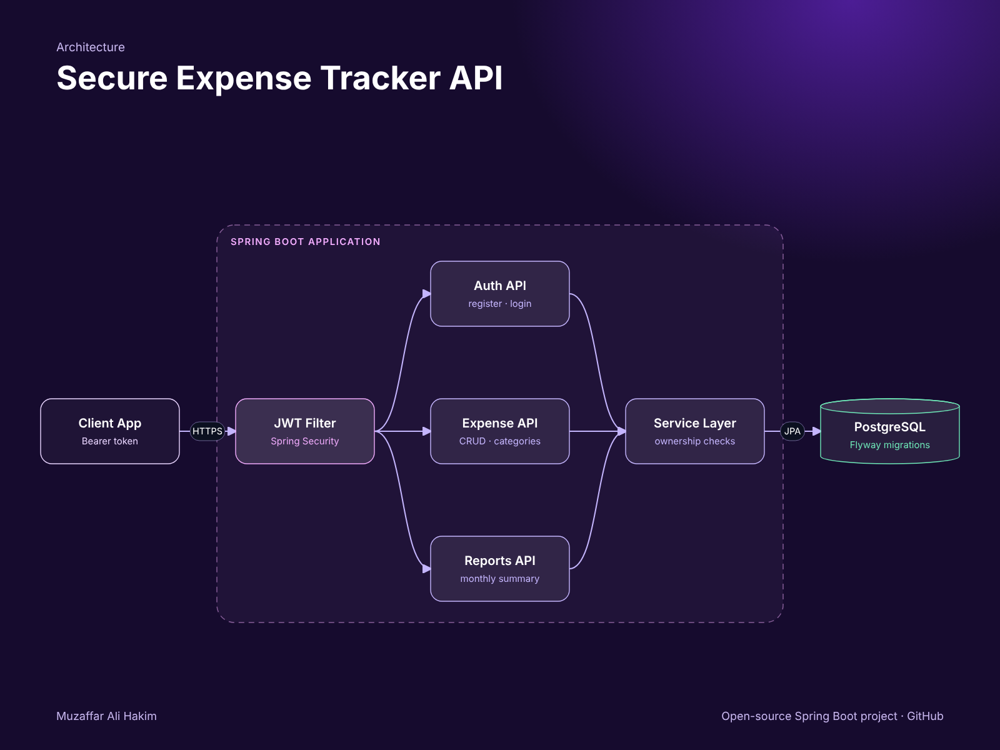

# Secure Expense Tracker API


  

A secure, multi-user expense tracking REST API built with **Java 21, Spring Boot, Spring Security (JWT), Spring Data JPA, PostgreSQL and Flyway**.
Each user registers, logs in, and manages only their own categories and expenses, with monthly spending reports.



## Features

- **Stateless JWT authentication** with Spring Security 6 (BCrypt passwords, `Authorization: Bearer` tokens)
- **Data isolation per user** — every query is scoped to the logged-in user; other users' records return 404
- **Expenses CRUD** with filters (date range, category) and pagination, sorted newest first
- **Categories** with unique names per user
- **Monthly reports** — total spend and a per-category breakdown using a JPQL aggregate query
- **Flyway migrations** own the schema (`ddl-auto: none`)
- **Validation** and RFC 7807 `ProblemDetail` error responses
- **OpenAPI / Swagger UI** with a Bearer-token "Authorize" button
- **Tests**: JWT unit tests and end-to-end MockMvc tests (auth, CRUD, reports, isolation) on H2
- **Docker Compose** and GitHub Actions CI

## Tech stack

| Layer | Technology |
| --- | --- |
| Language | Java 21 |
| Framework | Spring Boot 3.5 (Web, Security, Data JPA, Validation, Actuator) |
| Auth | JWT (jjwt 0.12), BCrypt |
| Database | PostgreSQL 16, Flyway (H2 in PostgreSQL mode for tests) |
| API docs | springdoc-openapi (Swagger UI) |
| Testing | JUnit 5, AssertJ, MockMvc, spring-security-test |
| DevOps | Docker, Docker Compose, GitHub Actions |

## Run it

```bash
docker compose up --build
```

Open **http://localhost:8080/swagger-ui.html**, call `POST /api/auth/register`, copy the `accessToken`, click **Authorize** and paste it.

Run the tests:

```bash
mvn verify
```

## API

| Method | Endpoint | Auth | Description |
| --- | --- | --- | --- |
| POST | `/api/auth/register` | – | Create an account, returns a JWT |
| POST | `/api/auth/login` | – | Log in, returns a JWT |
| GET | `/api/categories` | JWT | List your categories |
| POST | `/api/categories` | JWT | Create a category |
| DELETE | `/api/categories/{id}` | JWT | Delete a category (its expenses become uncategorized) |
| GET | `/api/expenses?from=&to=&categoryId=&page=&size=` | JWT | List and filter your expenses |
| POST | `/api/expenses` | JWT | Add an expense |
| GET / PUT / DELETE | `/api/expenses/{id}` | JWT | Read, update or delete one expense |
| GET | `/api/reports/monthly?year=2026&month=10` | JWT | Monthly total and category breakdown |

### Example

```bash
# 1. Register
TOKEN=$(curl -s -X POST localhost:8080/api/auth/register -H "Content-Type: application/json" \
  -d '{"email":"ali@example.com","password":"Str0ngPassw0rd!","fullName":"Ali Khan"}' | jq -r .accessToken)

# 2. Add a category and an expense
curl -s -X POST localhost:8080/api/categories -H "Authorization: Bearer $TOKEN" \
  -H "Content-Type: application/json" -d '{"name":"Food"}'
curl -s -X POST localhost:8080/api/expenses -H "Authorization: Bearer $TOKEN" \
  -H "Content-Type: application/json" -d '{"amount":25.50,"description":"Lunch","spentOn":"2026-10-01","categoryId":1}'

# 3. Monthly report
curl -s "localhost:8080/api/reports/monthly?year=2026&month=10" -H "Authorization: Bearer $TOKEN"
```

```json
{
  "year": 2026,
  "month": 10,
  "total": 25.50,
  "count": 1,
  "byCategory": [ { "category": "Food", "total": 25.50, "count": 1 } ]
}
```

## How authentication works

1. `AuthService` hashes passwords with BCrypt and issues an HMAC-signed JWT containing the user id and email.
2. `JwtAuthFilter` runs before Spring Security's username/password filter, validates the token and sets an `AuthUser` principal.
3. Controllers receive the user with `@AuthenticationPrincipal AuthUser user`; services always query by `user.id()`.

Set your own key in production: `JWT_SECRET=$(openssl rand -base64 48)`.

## Project structure

```
src/main/java/com/muzaffar/expensetracker
├── auth       # register / login, User entity
├── security   # SecurityConfig, JwtService, JwtAuthFilter
├── category   # categories per user
├── expense    # expenses CRUD, filtering with JPA Specifications
├── report     # monthly aggregate report
├── common     # errors, paging DTO
└── config     # OpenAPI
src/main/resources/db/migration   # Flyway SQL migrations
```

## License

MIT
